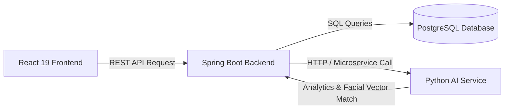

# 🚀 SMART Online Examination System — Backend API Integration Contract

This document specifies the exact REST API endpoints, DTO models, headers, and authentication flow required by the React frontend. The Java Spring Boot backend team member can follow this guide to build the Spring Boot controllers and database tables.

---

## 🔐 1. Authentication & Security Policy

- **Base URL**: `/api` (Configurable via `VITE_API_BASE_URL` in `.env`)
- **Headers**:
  ```http
  Content-Type: application/json
  Authorization: Bearer <JWT_TOKEN>
  ```
- **Session Expiry**: Returns `HTTP 401 Unauthorized` when JWT expires; frontend automatically redirects to `/login`.

---

## 📑 2. Complete REST API Endpoints Specification

### 🔑 Auth Controller (`/api/auth`)
| Method | Endpoint | Description | Request Body | Response JSON |
| :--- | :--- | :--- | :--- | :--- |
| `POST` | `/api/auth/login` | User Login | `{ "email": "...", "password": "..." }` | `{ "token": "JWT_STRING", "user": { "id": 1, "name": "...", "email": "...", "role": "ADMIN" \| "TEACHER" \| "STUDENT" } }` |
| `POST` | `/api/auth/forgot-password` | Password Reset Request | `{ "email": "..." }` | `{ "message": "Reset link sent" }` |
| `POST` | `/api/auth/reset-password` | Reset Password | `{ "token": "...", "password": "..." }` | `{ "message": "Password updated" }` |
| `POST` | `/api/auth/logout` | Logout Session | `{}` | `{ "message": "Logged out" }` |

---

### 🛡️ Admin Controller (`/api/admin`)
| Method | Endpoint | Description | Request / Query | Response JSON |
| :--- | :--- | :--- | :--- | :--- |
| `GET` | `/api/admin/dashboard` | Dashboard Metrics | None | `{ "totalStudents": 120, "totalTeachers": 15, "totalSubjects": 8, "totalExams": 24, "activeExams": 2, "completedExams": 18, "totalAttempts": 340, "recentActivity": [] }` |
| `GET` | `/api/admin/students` | Get Student List | Optional `?search=&status=` | Array of Student objects |
| `POST` | `/api/admin/students` | Upsert Student | `{ "name": "...", "email": "...", "department": "CS", "semester": "Semester 6" }` | Saved Student object |
| `DELETE` | `/api/admin/students/:id` | Delete Student | Path variable `id` | `{ "success": true }` |
| `GET` | `/api/admin/teachers` | Get Teacher List | Optional `?search=` | Array of Teacher objects |
| `POST` | `/api/admin/teachers` | Upsert Teacher | `{ "name": "...", "email": "...", "department": "SE" }` | Saved Teacher object |
| `DELETE` | `/api/admin/teachers/:id` | Delete Teacher | Path variable `id` | `{ "success": true }` |
| `GET` | `/api/admin/subjects` | Get Subject List | None | Array of Subject objects |
| `POST` | `/api/admin/subjects` | Upsert Subject | `{ "name": "...", "description": "..." }` | Saved Subject object |
| `DELETE` | `/api/admin/subjects/:id` | Delete Subject | Path variable `id` | `{ "success": true }` |

---

### ❓ Question Bank Controller (`/api/questions`)
*(Note: Teachers manually author all exam questions. AI question generation is strictly prohibited.)*

| Method | Endpoint | Description | Request Body | Response JSON |
| :--- | :--- | :--- | :--- | :--- |
| `GET` | `/api/questions` | Get Questions | Optional `?subject=&difficulty=` | Array of Question objects |
| `GET` | `/api/questions/:id` | Get Question Details | Path variable `id` | Question object |
| `POST` | `/api/questions` | Create Question | `{ "subject": "Java", "topic": "OOP", "difficulty": "EASY", "marks": 2, "text": "...", "optionA": "...", "optionB": "...", "optionC": "...", "optionD": "...", "correctAnswer": "A" }` | Created Question object |
| `PUT` | `/api/questions/:id` | Update Question | Question payload | Updated Question object |
| `DELETE` | `/api/questions/:id` | Delete Question | Path variable `id` | `{ "success": true }` |

---

### 📝 Exam Controller (`/api/exams`)
| Method | Endpoint | Description | Request Body | Response JSON |
| :--- | :--- | :--- | :--- | :--- |
| `GET` | `/api/exams` | Get All Exams | Optional `?status=` | Array of Exam objects |
| `GET` | `/api/exams/my` | Get My Exams | None | Array of Exam objects |
| `GET` | `/api/exams/available` | Available Student Exams | None | Array of Active Exam objects |
| `GET` | `/api/exams/:id` | Get Exam Room Data | Path variable `id` | Exam object with nested `questions` array |
| `POST` | `/api/exams` | Create Exam | `{ "name": "...", "subject": "...", "questionIds": [1,2,3], "duration": 45, "startDate": "...", "endDate": "...", "passingMarks": 50 }` | Created Exam object |
| `POST` | `/api/exams/:id/submit` | Submit Exam Answers | `{ "answers": { "1": "A", "2": "C" } }` | Calculated ExamResult object |

---

### 📊 Results & AI Controller (`/api/results` & `/api/ai`)
| Method | Endpoint | Description | Response JSON |
| :--- | :--- | :--- | :--- |
| `GET` | `/api/results` | Faculty Results Overview | Array of ExamResult objects |
| `GET` | `/api/results/my` | Student Personal Results | Array of ExamResult objects |
| `GET` | `/api/results/:id` | Exam Result Details | Itemized ExamResult object |
| `GET` | `/api/analytics/student` | Student Performance Analytics | `{ "overallPercentage": 84.2, "averageScore": 42.1, "examsAttempted": 8, "highestScore": 94, "lowestScore": 68, "topicPerformance": [...], "recentResults": [...] }` |
| `GET` | `/api/analytics/teacher` | Teacher Performance Analytics | `{ "avgScore": 75.8, "highestScore": 98, "lowestScore": 22, "passRate": 82.5, "totalSubmissions": 366, "examScores": [...], "topicAnalytics": [...] }` |
| `GET` | `/api/analytics/admin` | Institutional Growth Analytics | `{ "totalStudents": 1248, "totalTeachers": 64, "totalExams": 186, "totalAttempts": 3890, "avgScore": 76.4, "passRate": 84.2, "attemptsGrowth": [...], "subjectDistribution": [...] }` |
| `GET` | `/api/ai/recommendations` | Python AI Study Recommendations | `{ "weakTopic": "Java Exception Handling", "weakPercentage": 42, "recommendation": "...", "studyPlan": [...] }` |

---

## 🤖 3. Python AI Integration Architecture



1. **Direct React-Python calls are prohibited**.
2. React communicates exclusively with Spring Boot REST API endpoints.
3. Spring Boot delegates performance analytics recommendations and biometric vector matching to the Python AI service.

---

## 🎨 4. MUI v7 & Frontend Stack Standard

- **React 19**, **Vite 7**, **TypeScript 5.9**, **Material-UI (MUI v7)**, **Redux Toolkit**, **Redux Saga**.
- **Compilation Check**: Run `npx tsc -b` and `npx vite build` to verify 0 errors.
